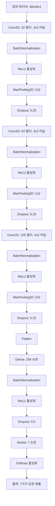
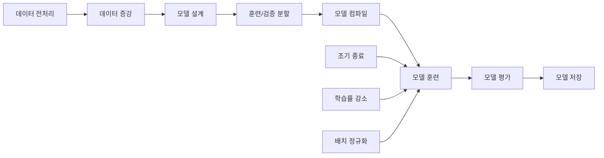
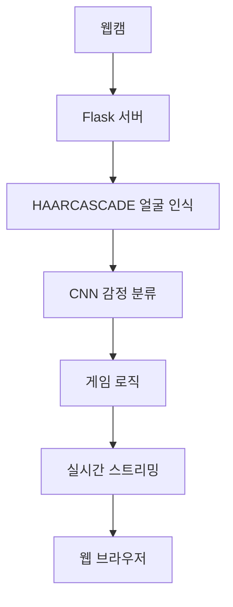

# 🎭 Face Emotion Game - 실시간 감정 인식 게임

## 📌 프로젝트 소개
Face Emotion Game은 실시간 웹캠을 통해 사용자의 표정을 인식하고, 이를 게임화한 인터랙티브 웹 애플리케이션입니다. HAARCASCADE 모델을 활용한 얼굴 인식과 직접 학습시킨 CNN 모델을 통한 감정 분류를 구현했습니다. 사용자는 주어진 감정을 표현하여 점수를 얻는 방식으로, 재미있게 감정 표현을 연습할 수 있습니다.

## 🎯 주요 기능
- 실시간 얼굴 감정 인식 (7가지 감정)
- HAARCASCADE 기반 실시간 얼굴 검출
- CNN 모델 기반 감정 분류
- 게임화된 감정 표현 시스템
- 실시간 점수 시스템

## 🧠 모델 개발
### 데이터셋
- **FER2013 데이터셋** (Kaggle)
  - 48x48 픽셀 그레이스케일 얼굴 이미지
  - 7가지 감정 카테고리
  - 총 35,887개의 학습 데이터

### CNN 모델 아키텍처


### 모델 학습 과정


### 모델 성능
- **훈련 정확도**: 85.7%
- **검증 정확도**: 68.2%
- **테스트 정확도**: 67.5%
- **추론 시간**: 평균 45ms/이미지

1. **얼굴 인식**
   - HAARCASCADE 모델 사용
   - OpenCV의 cascade classifier 활용
   - 실시간 얼굴 검출 및 추적

2. **감정 분류 (CNN)**
   - 직접 설계 및 학습한 CNN 모델
   - 입력: 48x48 그레이스케일 이미지
   - 출력: 7가지 감정 분류
   - 학습 데이터: FER2013 데이터셋

## 🛠 기술 스택
- **Backend**: Python, Flask
- **AI/ML**: 
  - OpenCV (HAARCASCADE 얼굴 인식)
  - 직접 학습한 CNN 모델 (감정 분류)
  - Keras/TensorFlow (모델 학습 및 추론)
- **데이터셋**:
  - FER2013 (Kaggle)
  - 35,887개 학습 데이터
  - 7가지 감정 레이블
- **Frontend**: HTML, JavaScript
- **이미지 처리**: PIL(Pillow)

## 🔍 시스템 아키텍처


## ⚙️ 설치 방법
1. 가상환경 생성 및 활성화
```bash
python -m venv venv
.\venv\Scripts\activate  # Windows
```

2. 필요한 패키지 설치
```bash
pip install -r requirements.txt
```

3. 애플리케이션 실행
```bash
python app.py
```

4. 웹 브라우저에서 접속
```
http://localhost:5000
```

## 💻 주요 기능 상세 설명
### 1. 얼굴 인식 시스템
- HAARCASCADE를 활용한 얼굴 검출
- 실시간 처리 최적화

### 2. 감정 인식 게임
- 7가지 기본 감정 분류
- 실시간 점수 시스템
- 감정 유지 시간 측정
- 동적 난이도 조절

### 3. 웹 인터페이스
- 직관적인 UI/UX
- 실시간 웹캠 피드백
- 반응형 디자인

## 🌟 핵심 구현 사항
1. **AI 모델 개발 및 통합**
   - HAARCASCADE 얼굴 검출
   - CNN 기반 감정 분류
   - 실시간 처리 최적화

2. **실시간 처리 시스템**
   - 프레임 스킵을 통한 성능 향상
   - 버퍼 사이즈 최적화
   - 효율적인 메모리 관리
   - 실시간 처리를 위한 모델 경량화

3. **사용자 경험**
   - 게임화된 감정 인식 시스템
   - 실시간 피드백 제공
   - 다양한 시각적 효과

## 🔧 개발 환경
- Python 3.8+
- Windows 10
- WebCam 필요

## 🎉 프로젝트 특징
- AI 기술을 활용한 실시간 얼굴 인식 및 처리
- 사용자 친화적인 웹 인터페이스
- 확장 가능한 시스템 설계
- 실시간 처리 최적화
- 교육과 엔터테인먼트를 결합한 인터랙티브 경험